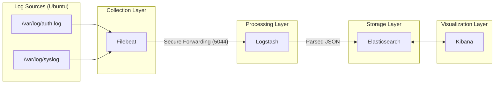

# VigiCore Architecture

## System Architecture

VigiCore follows a standard ELK stack pipeline architecture tailored for local intrusion detection.

## Component Details

### 1. Log Sources
*   **Target**: Real-time system logs.
*   **Format**: Syslog standard format.

### 2. Filebeat (Collector)
*   **Role**: Lightweight shipper.
*   **Function**: Tails log files, handles rotation, adds host metadata (hostname, OS), and forwards to Logstash using the lumberjack protocol.
*   **Why not direct to ES?**: We need Logstash's advanced parsing capabilities to normalize data before indexing.

### 3. Logstash (Processor)
*   **Role**: ETL Pipeline.
*   **Input**: Beats input on port 5044.
*   **Filter**:
    *   **Grok**: Patterns to extract `client_ip`, `user`, `status`, `port`, `ssh_method`.
    *   **Date**: Parses timestamps to standardize to `@timestamp`.
    *   **GeoIP (Optional)**: Can enrich IP addresses with location data.
    *   **Drop**: Removes low-value debug logs to save storage.
*   **Output**: Sends to Elasticsearch.

### 4. Elasticsearch (Storage & Search Engine)
*   **Role**: NoSQL Database / Search Index.
*   **Indices**: Rolling time-based indices (e.g., `vigicore-[YYYY.MM.dd]`).
*   **Optimization**: Custom mapping to ensure IP addresses are stored as `ip` type (for range queries) and keywords as `keyword` type (for aggregations).

### 5. Kibana (UI)
*   **Role**: Dashboard & Alerting Interface.
*   **Features**:
    *   **Discover**: Raw log exploration.
    *   **Visualizations**: Bar charts, pie charts, maps.
    *   **Dashboards**: Aggregated view of security posture.
